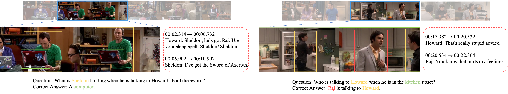
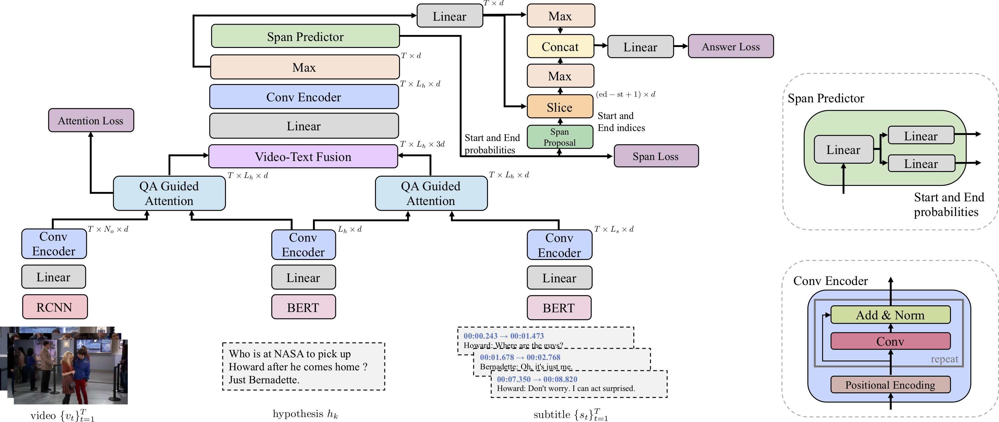
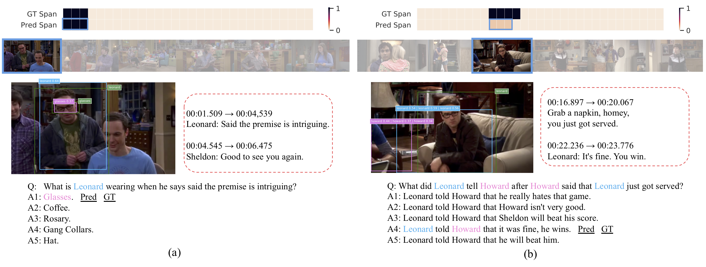

## TVQA+: Spatio-Temporal Grounding for Video Question Answering



We present the task of Spatio-Temporal Video Question Answering, which requires intelligent 
systems to simultaneously retrieve relevant moments and detect referenced visual concepts 
(people and objects) to answer natural language questions about videos. 
We first augment the [TVQA](http://tvqa.cs.unc.edu/) dataset with 310.8k bounding boxes, linking depicted objects to 
visual concepts in questions and answers. 
We name this augmented version as TVQA+.
We then propose Spatio-Temporal Answerer with Grounded Evidence (STAGE), 
a unified framework that grounds evidence in both the spatial and temporal domains to 
answer questions about videos. 
Comprehensive experiments and analyses demonstrate the effectiveness of our framework and 
how the rich annotations in our TVQA+ dataset can contribute to the question answering task. 
As a side product, by performing this joint task, our model is able to produce more insightful 
intermediate results. 


In this repository, we provide PyTorch Implementation of the STAGE model, along with basic 
preprocessing and evaluation code for TVQA+ dataset.


[TVQA+: Spatio-Temporal Grounding for Video Question Answering](https://arxiv.org/abs/1904.11574)<br>
[Jie Lei](http://www.cs.unc.edu/~jielei/),  [Licheng Yu](http://www.cs.unc.edu/~licheng/), 
[Tamara L. Berg](http://Tamaraberg.com), [Mohit Bansal](https://www.cs.unc.edu/~mbansal/). 
   [[PDF]](https://arxiv.org/abs/1904.11574) [[TVQA+ Dataset]](http://tvqa.cs.unc.edu)


### Model
- **STAGE Overview**. Spatio-Temporal Answerer with Grounded Evidence (STAGE), a unified framework that grounds evidence in both the spatial and temporal domains to answer questions about videos.  



- **Prediction Examples**
 


### Training and Evaluation
1, Download and uncompress preprocessed features from 
[Google Drive](https://drive.google.com/open?id=1GnknXfs9qKE-WVaUgUeKfCTLHjyzqCHG).

```
& uncompress the file into project root directory, you should get a dir `tvqa_plus_stage_features` 
containing all the required feature files.
cd $PROJECT_ROOT; tar -xf tvqa_plus_stage_features_new.tar.gz
```
[gdrive](https://github.com/prasmussen/gdrive) is a good tool to use for downloading the file. 
**The features are changed, you have to re-download the features if you have our previous version**

2, Run in `debug` mode to test your environment, path settings:
```
bash run_main.sh debug
```

3, Train the full STAGE model:
```
bash run_main.sh --add_local
```
note you will need around 30 GB of memory to load the data. Otherwise, you can additionally add `--no_core_driver` flag to stop loading 
all the features into memory. After training, you should be able to get ~72.00% QA Acc, which is comparable to the reported number.
The trained model and config file are stored at `${$PROJECT_ROOT}/results/${MODEL_DIR}`

4, Inference
```
bash run_inference.sh --model_dir ${MODEL_DIR} --mode ${MODE}
```
`${MODE}` could be `valid` or `test`. After inference, you will get a `${MODE}_inference_predictions.json` 
file in `${MODEL_DIR}`, which is similar to the sample prediction file here `eval/data/val_sample_prediction.json`.

5, Evaluation
```
cd eval; python eval_tvqa_plus.py --pred_path ../results/${MODEL_DIR}/valid_inference_predictions.json --gt_path data/tvqa_plus_val.json
```
Note you can only evaluate val prediction here. 
To evaluate test set, please follow instructions [here](http://tvqa.cs.unc.edu/leaderboard.html).  


### Citation
```
@inproceedings{lei2019tvqa,
  title={TVQA+: Spatio-Temporal Grounding for Video Question Answering},
  author={Lei, Jie and Yu, Licheng and Berg, Tamara L and Bansal, Mohit},
  booktitle={Tech Report, arXiv},
  year={2019}
}
```

### TODO
1. [-] Add data preprocessing scripts (provided preprocessed features)
2. [-] Add model and training scripts
3. [-] Add inference and evaluation scripts


### Contact
- Dataset: faq-tvqa-unc [at] googlegroups.com
- Model: Jie Lei, jielei [at] cs.unc.edu
